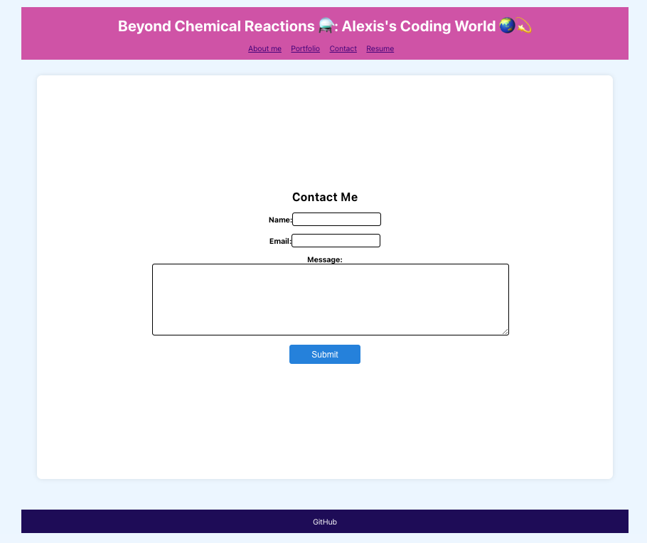

# React-Portfolio

[](https://opensource.org/license/mit/)

Welcome to my personal portfolio website built with React!

## Table of Contents
- [About](#about)
- [Installation](#installation)
- [Usage](#usage)
- [Folder Structure](#folder-structure)
- [Technologies Used](#technologies-used)
- [Images](#images)
- [Contact](#contact)

## About

This portfolio showcases my journey from a Chemical Engineer to a Full Stack Web Developer. It includes information about my professional experience, projects, and how to get in touch with me.

## Installation

To run this project locally, follow these steps:

1. Clone the repository:
   ```bash
   git clone https://github.com/alexislendechy/React-Portfolio
2. Navigate to the project directory:
   ```bash
   cd React-Portfolio
3. Install dependencies:
   ```bash
   npm install
## Usage
Start the development server:
   ```bash
   npm run dev
   ```
   It will automatically open your browser and go to http://localhost:3000 to view the application.

[](https://app.netlify.com/sites/react-portfolio-lendechy/deploys)

[**App deployed**](https://react-portfolio-lendechy.netlify.app/)

## Technologies used

* React
* React Router
* Vite (Build tool)
* ESLint (Linting)
* Serve (Static server)

## Images
**About me**


**Portfolio**


**Contact**



**Resume**


## Contact
Feel free to reach out to me for any inquiries or collaborations:

[GitHub](https://www.github.com/alexislendechy)

[Email](mailto:alexislendechy@gmail.com?subject=[GitHub]%20React%20Portfolio)


   